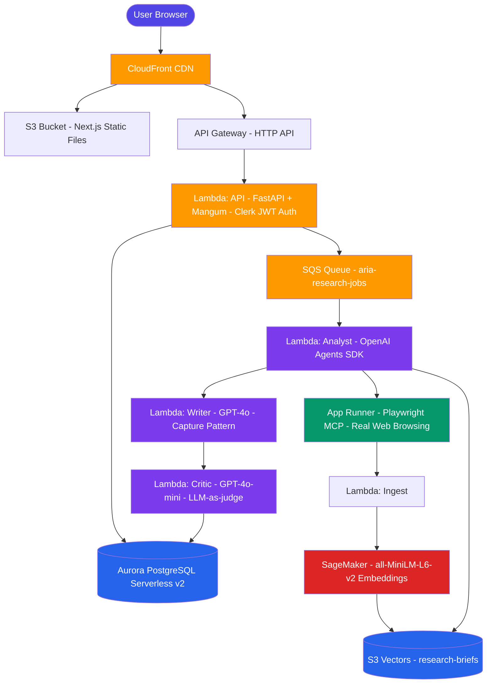

# README

# Architecture Overview

## Summary

Aria is a production multi-agent AI system that solves a real problem — research takes 8 hours, Aria takes 8 minutes.

Submit a topic. Aria browses real websites using Playwright MCP, synthesises findings using RAG, writes a structured intelligence briefing, and scores its own output for quality — all in 3 to 8 minutes, fully deployed on AWS.

### The pipeline

| Stage | Agent | Technology | What it does |
|-------|-------|-----------|--------------|
| 1 | Researcher | Playwright MCP + App Runner | Browses real websites — not training data |
| 2 | Analyst | GPT-4o + S3 Vectors | Synthesises findings with confidence scores |
| 3 | Writer | GPT-4o + Capture pattern | Produces structured 400+ word briefing |
| 4 | Critic | GPT-4o-mini + LLM-as-judge | Scores quality before delivery |

### Key engineering decisions

**Separate Lambdas over LangGraph inline** — LangGraph was d tested locally. The deliberate decision was not to deploy it inline — each agent stage needs to scale independently. The Analyst, Writer, and Critic have different compute profiles and concurrency requirements. A single Lambda running the full pipeline would eliminate this.

**App Runner over Lambda for the Researcher** — Playwright requires a persistent browser process. Lambda is ephemeral and unsuitable. App Runner provides always-on containers without Kubernetes complexity.

**Aurora Data API over direct connections** — Lambda scales to hundreds of concurrent instances. The Data API is HTTP-based and stateless — the only practical database access pattern for serverless workloads.

**The content capture pattern** — `result.final_output` from the OpenAI Agents SDK returns the agent's confirmation message, not the actual briefing content. Real content only exists inside the tool call. A module-level dictionary captures it before the agent moves on.

### Production stats

| | |
|--|--|
| Tests |  — unit, integration, database, evals |
| Infrastructure | 7 Terraform modules — fully reproducible |
| Cost per briefing | ~$0.18 (OpenAI GPT-4o + AWS compute) |
| Monthly infra cost | ~$55 at low traffic |
| Live URL | https://dhjx5b1vnreux.cloudfront.net |

)